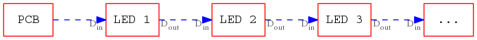
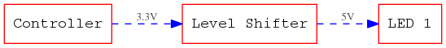

## Hardware

### Overview

The Hardware consists of a small [PCB](https://en.wikipedia.org/wiki/Printed_circuit_board) that contains an ESP8266 Microcontroller and some electrical components. The Microcontroller is the heart if the system. It runs the software to light up the LEDs and provides a WiFi interface to configure the device and interact with it.

The PCB has two connectors for LED strips. We decided to use WS2812B based Strips, as they are easy to use, cheap and broadly available. The LEDs have four connectors:

| Connector      |                    |
|----------------|--------------------|
| VCC            | The supply voltage |
| Din | Data input         |
| Din | Data output        |
| GND            | Ground             |

The data consists of a serial signal that gets consumed by the first LED. The first LED consumes exactly 24 bits (or 3 bytes) of data. 8 bit (or one byte) for each of the three base colors (red, green, blue). Each LED pixel has internally a seperate LED for these colors. The data represents their brightness. With this you can "mix" almost every color for each LED.

All data that the LED recieves after these 24 bit is sent out to the D~out~ connection, which is connected to the Din of the next LED. With this you can pass all your data through one D~in~ of your first LED, which makes the wiring very easy:

### Electronic Components

The big chunk on the Board that sits on the space labelled with _U2_ in the pickture above is the microcontroller. The bit that overlaps the PCB is its WiFi antenna. The _U1_ labelled thing is a voltage regulator, that provides teh microcontroller with stable 3.3V.

Because the LEDs use 5V Voltage for operation and Data and the microcontroller we use uses 3.3V. To make sure, the LED recognize our data we need something called a [Level Shifter](https://en.wikipedia.org/wiki/Level_shifter). This piece "translates" the 3.3V sognals to 5V. As we have two channels for LEDs we have two of these level-shifters on the board. They consist of a MOSFET and two resistors. You can locate them by the Labels _Q1_ and _Q2_ on the board. from there it goes to the connectors for the LEDs that are labelled with _J1_ and _J2_.

The little button on the PCB is connected to the reset pin of the microcontroller. Pres this to reset (reboot) the controller.

The remaining components are the connectors and some resistors, diodes and capacitors. Some of them are necessary to bring the controller in the right state after boot, some are part of the level shifters. For more details we provide the [Schematic](https://en.wikipedia.org/wiki/Schematic) of the whole board long with the source code of the Software. You can view the latest [PDF Version](https://github.com/Retardigrades/blinkenhat/raw/master/hardware/export/blinkenhat-schematic.pdf) online.

### Connectors

The board has several connectors. They are all named with _JX_ where _X_ is the number of the connector. The connectors come in three types that serve different purposes.

| Name | Description                                                           |
|------|-----------------------------------------------------------------------|
| J1   | Output for LED strip 1.                                               |
| J2   | Output for LED Strip 2.                                               |
| J3   | Input port for two switches.                                          |
| J4   | Pin header to program the ESP. It is compatible to the ESP-01 module. |
| J5   | The USB port to power the board.                                      |
| J6   | Extension header containing all free pins. See [schematic](https://github.com/Retardigrades/blinkenhat/raw/master/hardware/export/blinkenhat-schematic.pdf) for allocation details. |

The connectors _J1_ and _J2_ can be used to connect LED strips to it. They carry the supply voltage and a signal from one of the level shifters. For your hat we use only _J1_. _J2_ is free to be used by your own creation - no matter if you attach more LEDs to your hat or something completely different.

_J3_ has two pins that are connected to two input connections of the microcontroller and a _GROUND_ signal. you can add two switches between these and map them to your animation.

The pin header _J4_ is meant to be used to program your controller. It is wired exactly as the pin-header on a common ESP-01 module. You can find the pin allocation easily [on the internet](http://simba-os.readthedocs.io/en/latest/_images/esp01-pinout.png). **ATTENTION:** Take care that you use it in the right orientation: The row with the _VCC_ pin is on the edge of the BlinkenHat board.

_J5_ is the USB plug to power the board. There are no other pins connected that _GROUND_ and _VCC_. So you wont be able to transfer any data to anywhere with that connector. We considered to make the board directly programmable via USB but this would have increased the complexity and the cost.

The last onnector _J6_ was built in for extensibility. It gives you access to all unused pins of the microcontroller and the 3.3V supply voltage of it. This can be useful if you want to extend or change the software to include sensors or add other things. The actual pin allocation is documented in the [schematic](https://github.com/Retardigrades/blinkenhat/raw/master/hardware/export/blinkenhat-schematic.pdf) of the board.
